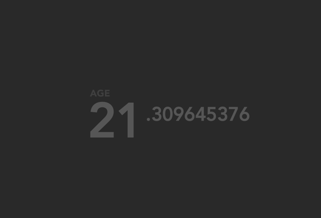

dark-motivation
==============

A chrome extension that replaces your chrome new tab page with your ever-rising
age, on a dark background.

## About

This chrome extension is based off of the freely available
[Motivation](https://chrome.google.com/webstore/detail/motivation/ofdgfpchbidcgncgfpdlpclnpaemakoj)
chrome app. The screenshot on the app store showed a dark background, but I
couldn't find any way to change the background in the app settings. I made this
variation as a result, to get the darker background.

## Installing

1. Clone/download this repo somewhere locally.
2. With Google Chrome, go to `chrome://extensions`
3. Click `Add unpacked extension...`
4. Choose the folder you just cloned/downloaded.
5. Check Google Chrome's new tab page, enter DOB.

Based off of [this](https://github.com/maccman/motivation).
